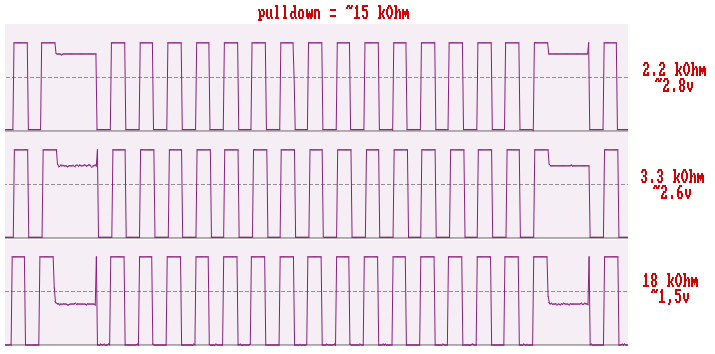
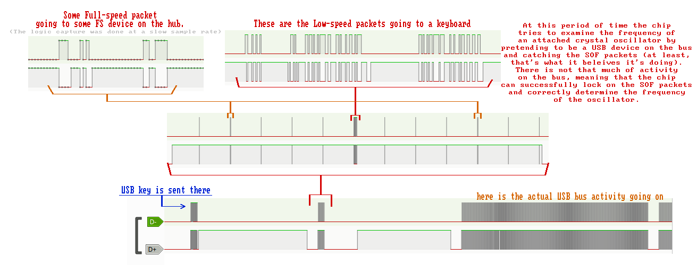

# USB_KEY

The chips have a Mask ROM that contains the initial boot code, alongside with a USB bootloader used to program the chip's flash, among other things.

It can be invoked either by not letting it boot successfuly (by corrupting/erasing/disconnecting the flash)
or by sending a special signal on the USB lines, which seems to be called "USB_KEY".

## Details

The key is a 16-bit number 0x16EF (0001 0110 1110 1111) that is send MSB-first over the USB lines with the D+ being the clock signal (data is latched by the chip on its rising edge), and D- being the data signal.

This sequence is sent repeatedly until the chip acknowledges it by pulling both lines low for about 1-2 ms:
(in the example below I had a pullup only attached to the clock signal)

Basically at that point the chip inhibits further reception of the key, and proceeds to initialize the USB interface.

The dongle should stop sending the key and switch the chip's USB bus into the PC side.

The clock frequency is usually around 50 kHz, but there isn't really any strict requirements other than
it should be not too fast as the reception is done purely in software (with the assistment of a timer that is used to catch a rising edge on the clock).

### Response considerations

Since the chip acknowledges the reception of the key by pulling down both USB signals, naturally you'd try to sense that by using pullups, perhaps the ones that are built in into your MCU.

The problem is that the chip also has its pulldowns enabled at the moment it receives the key,
since we are sending the key over the USB pins, the pulldows have resistance of 15 kOhm (as per the USB spec).

This may pose some issues with typical built-in MCU pullups that are usually specified at around 20 kOhm or more, meaning that the pulldown resistance on the chip
together with a pullup on a MCU will form a potential divider, making the voltage level fall under the high level threshold, and possibly the low level threshold too,
potentially leading to the pins to report a LOW level and thus leading to a false acknowledgement, even if the chip hasn't actually done that.

The situation becomes even worse when you have the PC side directly attached to the chip.
Now you have the PC side also pulling the bus down with its 15 kOhm pulldowns, meaning that the total pulldown resistance halves down to 7.5 kOhm.

So in order to guarantee correct sensing of the acknowledge, you need to attach an external strong pullup that could outperform the worst-case scenario above. Resistors below 4.7 kOhm are suggested.

Here is a comparsion of three random resistors I decided to test for now:

## USB bus considerations

When the chip enters the boot mode (or it fails to boot from flash and so it enters the boot mode),
before intializing the actual USB interface it tries to examime the frequency of a clock source it uses in order to properly intialize the main PLL that is used to generate clocks needed for the USB interface controller.

This is done by the chip pulling up the D+ line and watching for falling edges on that line, and using the period between them as a reference to more or less precisely calculate the reference clock frequency.

Normally these pulses are the SOF packets that come at precise 1 ms interval.
However at that point the chip can't distinguish between a valid SOF packet and something else on the bus (since the actual USB interface can't be used yet).

This means that any noise from other USB devices on the same bus (hub) can disturb the frequency detection and cause some unexpected results (like a wrong frequency calculation and therefore inability to work properly from now on).

This is caused by the general principle on how the USB hubs work (read the USB spec for more details), the ways to mitigate that include:
 - Using a separate USB 2.0 (and faster) hub, connecting only the chip itself and no other Full or Low-speed device (except when the hub is of the MTT type as opposed to the STT type)
 - Connecting to a different USB host controller to which no other full/low speed device are attacted.
   * if you're using a xHCI host, there the ports are isolated from each other by design (as far as I can tell), so the problem might be somewhere else.

Another way of mitigating that is to let the dongle send the SOF packets after it had received an acknowledge, instead of connecting the PC side right away.
You need to sense when the D+ line comes high and just send the negative pulses precisely 1 ms apart, and do that until the D+ line comes down.
At that moment you can now connect the actual USB bus into the chip, and it can now work regardless of what's happening on the USB bus at that moment.

Here are the examples (using an AC696N chip, being connected to a STT hub) in the case of a little bus activity on the chip's USB bus:

And when the bus is active, with the host polling a USB-UART bridge in this case:

In the second image it can be clearly seen that the period where the chip checks for SOFs is much shorter than in the first image.
(even when the first image is time-compressed the same way as the second one is)

This means that the chip has locked onto the wrong packets and so it had a wrong feeling of time. Later on the host tries to talk with the chip with no success.
After some time the chip simply gets reset by a watchdog, and it proceeds to run the firmware from flash instead of running the USB bootloader.
